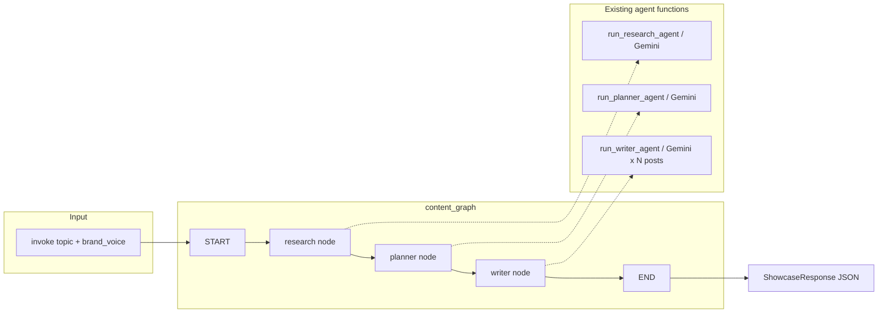
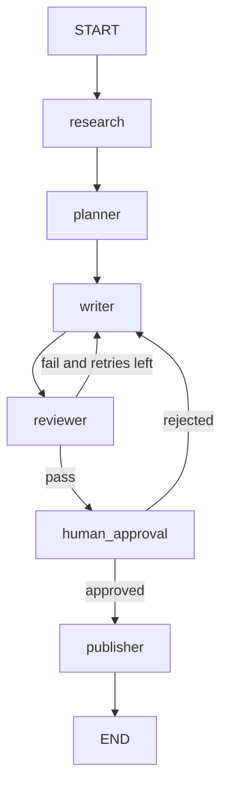

# LangGraph Workflow — AI Social Media Manager

This document explains how LangGraph runs the content pipeline in this project: what state is, what a node does, how edges connect them, and what happens on one full request.

**Code:** `backend/app/graphs/sample_graph.py`  
**Triggered by:** `POST /api/showcase/plan` in `backend/app/api/agents.py`

---

## Why LangGraph is here

The three agents already exist as normal Python functions:

| Agent | Function | Output |
|---|---|---|
| Research | `run_research_agent(topic)` | `ResearchReport` |
| Planner | `run_planner_agent(research_report)` | `WeeklyContentPlan` |
| Writer | `run_writer_agent(plan, brand_voice)` | `WrittenContentBatch` |

LangGraph does **not** replace those functions. It **orchestrates** them.

- Each agent is a **node**.
- Data shared between them is **state**.
- The order they run is defined by **edges**.
- The API only starts a run (`invoke`) and reads the final state.

That means FastAPI does not hard-code “call research, then planner, then writer.” Later features (review loops, human pause, memory) can be added as extra nodes on the same graph.

---

## End-to-end path (what the user actually hits)

```
Browser (Next.js :3000)
    POST { topic, brand_voice }
        ↓
FastAPI  POST /api/showcase/plan  (:8001)
        ↓
content_graph.invoke({ topic, brand_voice })
        ↓
LangGraph:  START → research → planner → writer → END
        ↓
JSON: research_report + content_plan + written_content
        ↓
Frontend renders the three pipeline stages
```

Isolated test routes (`/api/research`, `/api/plan`, `/api/write`) still call agents **directly**. They are not part of the graph. Only the full showcase uses LangGraph.

---

## The three building blocks

### 1. State — the shared notebook

`ContentPipelineState` is a TypedDict. Every node receives the current notebook and returns only the fields it wants to update. LangGraph **merges** those updates into state.

| Field | When it exists | Written by |
|---|---|---|
| `topic` | From the first `invoke` | API / user |
| `brand_voice` | From the first `invoke` | API / user |
| `research_report` | After the research node | `research_node` |
| `content_plan` | After the planner node | `planner_node` |
| `written_content` | After the writer node | `writer_node` |

`topic` and `brand_voice` are required at start. The other three are `NotRequired` because they do not exist yet when the graph begins.

### 2. Nodes — one job each

A node is a Python function: `state in → dict of updates out`.

| Node name | Calls | Returns |
|---|---|---|
| `research` | `run_research_agent(topic)` | `{ research_report }` |
| `planner` | `run_planner_agent(research_report)` | `{ content_plan }` |
| `writer` | `run_writer_agent(plan, brand_voice)` | `{ written_content }` |

Nodes stay thin. Prompts, Gemini, and Pydantic schemas live in `backend/app/agents/` and `backend/app/schemas/`.

### 3. Edges — the wiring

```
START  →  research  →  planner  →  writer  →  END
```

These are **normal edges** (always take this path). There is no branching yet. Conditional edges come with the Reviewer (Module 7).

`compile()` turns this definition into `content_graph`, a runnable object.

---

## One full run, step by step

Example request:

```json
{ "topic": "AI tools for founders", "brand_voice": "professional" }
```

### Step 0 — invoke

The API calls:

```python
final_state = content_graph.invoke({
    "topic": "AI tools for founders",
    "brand_voice": "professional",
})
```

LangGraph creates state:

```text
{
  topic:        "AI tools for founders",
  brand_voice:  "professional"
}
```

Execution starts at `START`, which always goes to `research`.

### Step 1 — research node (Module 4)

1. Reads `state["topic"]`.
2. Calls Gemini via `run_research_agent`.
3. Gemini returns structured JSON matching `ResearchReport` (trends, sentiment, news, angles).
4. Node returns `{ "research_report": report }`.

State after merge:

```text
{
  topic:            "AI tools for founders",
  brand_voice:      "professional",
  research_report:  { topic, key_trends, audience_sentiment, recent_news, potential_angles }
}
```

Edge: `research → planner`.

### Step 2 — planner node (Module 5)

1. Reads `state["research_report"]`.
2. If it is missing, raises (the graph would be broken).
3. If it arrived as a plain dict, converts it back with `ResearchReport.model_validate`.
4. Calls `run_planner_agent` → Gemini fills `WeeklyContentPlan` (strategy, audience, 5 post ideas).
5. Node returns `{ "content_plan": plan }`.

State after merge:

```text
{
  topic, brand_voice, research_report,
  content_plan: { research_topic, strategy_summary, target_audience, post_ideas[] }
}
```

Edge: `planner → writer`.

### Step 3 — writer node (Module 6)

1. Reads `content_plan` and `brand_voice`.
2. Calls `run_writer_agent`, which loops each `PostIdea` and makes **one Gemini call per post**.
3. Each post follows platform rules (LinkedIn / Instagram / Twitter / Facebook) plus the brand voice preset.
4. Node returns `{ "written_content": batch }`.

State after merge (final):

```text
{
  topic,
  brand_voice,
  research_report,
  content_plan,
  written_content: { research_topic, brand_voice, posts[] }
}
```

Edge: `writer → END`. The graph stops.

### Step 4 — API response

The API reads the three outputs from `final_state` and returns them as `ShowcaseResponse`. If any of the three is missing, it returns HTTP 500.

The frontend already expects this JSON shape, so the UI does not need to know LangGraph exists.

---

## Diagram of the current graph



---

## How state is merged (important)

A node does **not** return the full state. It returns a patch.

```python
# research_node does not return topic or brand_voice again
return {"research_report": report}
```

LangGraph keeps the old keys and overwrites / adds the new ones. That is why `brand_voice` set at invoke is still there when the writer runs, even though research and planner never touched it.

---

## What is compiled vs what runs

| Moment | What happens |
|---|---|
| Backend process starts | `content_graph = build_content_graph()` runs once. Nodes and edges are wired. No LLM calls. |
| Each HTTP request | `content_graph.invoke(...)` walks the graph once. Gemini is called inside the agent functions. |

So the graph structure is built at import time. Each user request is a **new walk** with a **new state**. Runs do not share state today (no checkpointer yet).

---

## How later modules attach to this same graph

The current graph is a straight line on purpose. The planned product adds nodes to **this** state, not a second pipeline.



| Module | LangGraph feature | What changes |
|---|---|---|
| **7 Reviewer** | Conditional edge | After writer, score grammar/tone/brand. Fail → writer again. Pass → continue. Needs a `revision_count` on state so it cannot loop forever. |
| **8 Human approval** | `interrupt` + checkpointer | Graph pauses before publish. API returns “waiting.” UI approves. Same `thread_id` resumes. |
| **9 Publisher** | New node | Reads `written_content`, posts or schedules via adapters (LinkedIn first). |
| **10 Memory** | Checkpointer (Postgres) | State is saved after each node so a paused run can resume. |
| **11–12 Analytics / Strategy** | Extra nodes or a second graph | Read engagement metrics, write next week’s strategy into state. |

Until those exist, the graph is linear: research → plan → write → done.

---

## File map

```
backend/app/graphs/sample_graph.py   ContentPipelineState, nodes, compiled content_graph
backend/app/api/agents.py            invoke() on showcase; isolated agent routes
backend/app/agents/research_agent.py  Gemini research (not a graph)
backend/app/agents/planner_agent.py   Gemini weekly plan
backend/app/agents/writer_agent.py    Gemini posts
backend/app/schemas/plan.py           WeeklyContentPlan, PostIdea
backend/app/schemas/content.py        WrittenPost, WrittenContentBatch
frontend/src/app/page.tsx             Calls /api/showcase/plan, renders stages
```

---

## Short mental model

1. User types a topic and a brand voice.
2. FastAPI puts those two fields into LangGraph state.
3. The **research** node fills `research_report`.
4. The **planner** node reads that report and fills `content_plan`.
5. The **writer** node reads the plan + voice and fills `written_content`.
6. LangGraph hits **END**. The API returns all three objects.
7. The UI shows Research, Plan, and Writer as three stages of the same run.
