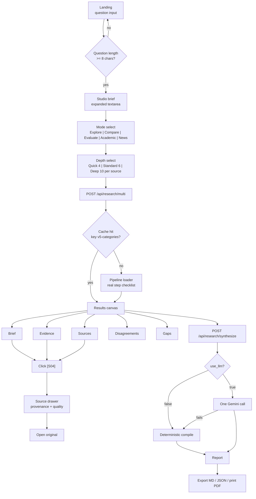

# Atelier — Design Specification

*A desk where sources become understanding.*

---

## 0. Product

Atelier turns a research question into ranked multi-source evidence and a cited report. It gathers Web (Tavily), News (Google News RSS), Papers (Semantic Scholar, OpenAlex, Crossref, arXiv) and GitHub in parallel through a FastAPI + LangGraph graph, caches results on disk (key `v5-categories`), and compiles a deterministic report that Gemini may optionally rewrite in exactly one call. No auth, no saved history, session state only. Frontend is Next.js with Bodoni Moda and Instrument Sans on paper stock. The question Atelier answers is **"help me investigate this question and understand the evidence"** — not open-ended conversational search.

---

## 1. Design intent

A research desk, not a dashboard and not a chat window.

The physical reference is a working desk mid-investigation: a sheet of paper with the question at the head, findings written down the measure, and source cards laid out along the right margin with pencil lines drawn from a claim to the card that supports it. Atelier's job is to keep that line visible. Every design decision below is judged against one test: **can the reader get from a sentence to the source that justifies it in one move, without losing their place?**

The interface should feel like it was set, not rendered. Type does the work. Colour is used the way a researcher uses a pen: sparingly, to mark, never to fill.

---

## 2. Visual identity

| Element | Direction |
|---|---|
| Surface | Warm uncoated paper. Flat, no shadow, no blur, no gloss. Depth comes from rules and inset panels, not elevation. |
| Structure | Press sheet. A fixed text measure with a live margin column, exactly like a scholarly edition with apparatus in the margin. |
| Marks | Hairline rules (0.5px), rule stubs, hanging indents, folio numbers, small-caps eyebrows. |
| Citations | Set in typewriter mono, boxed with a 1px rule, sitting on the baseline like a stamped reference: `[S04]` `[P02]` `[N11]` `[G03]`. |
| Sources | Index-card stubs in the margin rail. Not tiles. Ruled top and bottom, no border box, no radius. |
| Scores | Notched rules, five notches, never a decimal, never a progress bar. |
| Temperature | Cool grey-warm paper, ink black, four functional inks. Nothing glows. |

### Signature element — **the thread**

Every citation marker in the reading column is tied to its source stub in the right margin rail by a hairline connector that draws itself on hover or focus.

```
  reading column                              margin rail
  ────────────────────────────                ───────────────
  Most production deployments
  still favour retrieval over ╌╌╌╌╌╌╌╌╌╌╌╌╌╮
  long context [S04][P02].                  ╰─ [S04] Anyscale
                                               eng blog · 2026
                                               ▌▌▌▌▌ relevance
                                            ───────────────
                                               [P02] arXiv
                                               2601.08812
```

The thread is the whole product in one gesture: a claim is never more than a line away from its evidence. Nothing else on the page animates on hover. Boldness is spent here and nowhere else.

**Why this and not the obvious alternative.** The default move for a "sources" product is a footnote popover on click. A popover hides the map: the reader sees one source at a time and never sees that six claims lean on the same press release. The persistent rail shows source concentration at a glance, and the thread makes the link explicit without covering the text.

---

## 3. Anti-patterns

Hard NO list. If a component drifts toward any of these, it is wrong regardless of how good it looks.

| Banned | Because |
|---|---|
| Chat bubbles, message threads, typing indicators | Atelier is not conversational. A question is a heading, not a message. |
| Glassmorphism, blur, frosted panels | Fake depth on a paper surface. |
| Purple/blue AI gradients, glow, sparkle icons | Makes the AI the subject. The evidence is the subject. |
| KPI tiles ("142 SOURCES" in 64px) | Metric theatre. Counts are metadata, set them small. |
| Fully rounded pill CTAs | Product-marketing vernacular, wrong register. Radius ceiling is 2px. |
| Neumorphism, soft shadows, embossing | Same reason as glass. |
| Card grids for everything | Cards imply peer objects. Sources are ranked rows, not a gallery. |
| Skeleton shimmer loaders | Dishonest. Show the real pipeline step instead. |
| Emoji as UI iconography | Set marks in type or draw them. |
| Animated "AI thinking" copy | Name the actual API being called. |
| Percentages with decimals on scores | Fake precision. See §D6. |

---

## 4. Colour tokens

Six inks on one paper. Colour is never decorative fill; it marks category, state, or evidence class only.

| Token | Hex | Role |
|---|---|---|
| `--paper` | `#F5F1E8` | Page stock |
| `--paper-2` | `#EDE7DA` | Inset panels, table zebra, drawer back |
| `--paper-3` | `#E2DBCB` | Rules, hairlines, dividers |
| `--ink` | `#171717` | Primary type |
| `--ink-2` | `#57534B` | Secondary type, metadata |
| `--ink-3` | `#8A8377` | Tertiary, disabled, placeholder |
| `--research-red` | `#B23124` | The active mark: current mode, focus, live pipeline step, the thread |
| `--evidence-blue` | `#2C4A7C` | Papers, primary/academic evidence class |
| `--verified-green` | `#3F6B4A` | Confirmed, high-agreement, cache hit, completed step |
| `--warning-amber` | `#9C6B1E` | Disagreement, weak evidence, stale source, partial failure |
| `--ink-wash` | `#171717` @ 6% | Selection, hover row, code fill |

Rules for use:

* One red per screen state. If two things are red, one of them is wrong.
* Evidence class is shown by **ink colour + label**, never colour alone (§10).
* No colour behind body text. Marks live in the margin, in the rule, or in the glyph.
* Dark mode is **not** shipped and not planned for V1. Inverting paper stock breaks the metaphor; if it is ever built it becomes "carbon" (`#14140F` ground, `#E8E2D4` type), specified separately.

---

## 5. Typography

| Role | Face | Usage |
|---|---|---|
| Display | **Bodoni Moda** | Question headings, screen titles, the short answer. High contrast, tight tracking, never below 24px, never bold-italic. |
| UI / body | **Instrument Sans** | Everything readable: labels, controls, table text, findings body. |
| Utility mono | **Courier Prime** | Citation IDs, source codes, API/endpoint text, scores, folio numbers, timestamps. |

Type scale (1.25 ratio, base 16):

| Token | Size / line | Face | Use |
|---|---|---|---|
| `--t-display` | 44 / 1.05 | Bodoni | Landing title, results question |
| `--t-title` | 30 / 1.15 | Bodoni | Screen and tab titles |
| `--t-answer` | 22 / 1.45 | Bodoni | THE SHORT ANSWER paragraph |
| `--t-lead` | 18 / 1.55 | Instrument | Brief body, evidence claims |
| `--t-body` | 16 / 1.6 | Instrument | Default |
| `--t-small` | 14 / 1.5 | Instrument | Table cells, drawer body |
| `--t-eyebrow` | 11 / 1.2 | Instrument, 600, +0.14em, uppercase | Section kickers |
| `--t-mono` | 12 / 1.4 | Courier Prime | `[S04]`, scores, dates, folio |

Rules:

* Measure is capped at **68 characters**. The reading column never spans the viewport.
* Only three weights ship: Instrument 400 / 500 / 600. Bodoni 400 and 500 only.
* Italic Bodoni is reserved for one thing: the question when it is quoted back in a running head.
* Numerals: tabular in tables and scores, oldstyle in prose.
* No letter-spacing on body copy. Tracking is for eyebrows and mono only.

---

## 6. Layout

The canvas is a press sheet, not a dashboard grid. Three zones, fixed relationship, no drag, no resize, no widgets.

```
┌────────────────────────────────────────────────────────────────────────┐
│ RUNNING HEAD    ATELIER · "does rag still beat long context?" · EXPLORE │  48px, sticky
├──────────┬─────────────────────────────────────────┬───────────────────┤
│ RAIL     │ READING COLUMN                          │ MARGIN RAIL       │
│ 180px    │ 640px max, 68ch measure                 │ 280px             │
│          │                                         │                   │
│ Brief    │ Findings, evidence rows, tables         │ Source stubs      │
│ Evidence │                                         │ tied by thread    │
│ Sources  │                                         │                   │
│ Disagree │                                         │ Sticky, scrolls   │
│ Gaps     │                                         │ with claims       │
│          │                                         │                   │
│ ─────    │                                         │                   │
│ 24 srcs  │                                         │                   │
│ 4 fams   │                                         │                   │
└──────────┴─────────────────────────────────────────┴───────────────────┘
```

* **Running head** carries the question on every screen after landing. It is the anchor. It never scrolls away and it is always quoted, in Bodoni italic, truncated at one line with full text on hover/focus.
* **Rail** is canvas navigation, not app navigation. Sections, not pages. Current section marked with a red rule stub on the left edge, not a filled background.
* **Reading column** is single-column always. Two-column body text is not used, it breaks the thread geometry.
* **Margin rail** is populated only on Brief and Evidence. On Sources it collapses and the table takes the full width minus rail.
* Whitespace does the sectioning. Section breaks are 64px of air plus a hairline, not a boxed panel.

Grid spacing scale: `4 8 12 16 24 32 48 64 96`. Nothing off-scale.

---

## 7. Component inventory

| Component | Purpose | Key states |
|---|---|---|
| `RunningHead` | Anchors the question and mode on every post-landing screen | default, truncated, mode-changed |
| `ResearchQuestion` | The input. Bodoni textarea on paper, auto-growing, rule underneath instead of a box | empty, typing, too-short (<8 chars), submitting |
| `ModeSelector` | Explore / Compare / Evaluate / Academic / News. Ruled tabs, not pills | selected, hover, planned-badge on Compare/Evaluate |
| `DepthSelector` | Quick / Standard / Deep with the literal source budget printed under each | selected, disabled (Deep when no key) |
| `CategoryChips` | General, AI Engineer, Founder, Academic, News desk. Small caps, rule-underline on active | active, inactive |
| `ResearchProgress` | Real pipeline checklist with named sources and elapsed time | queued, running, done, failed, cached |
| `CanvasNav` | Left rail section switcher plus source/family counts | active, empty-section, planned-section |
| `SourceExplorer` | Ruled table of all sources: code, title, type, date, score | loading, populated, filtered, empty |
| `SourceDrawer` | Provenance panel: why ranked, quality notches, original link | opening, open, error-fetching-preview |
| `CitationMarker` | `[S04]` inline button, mono, boxed, thread origin | rest, hover (thread drawn), focus, active (drawer open) |
| `ResearchBrief` | THE SHORT ANSWER plus supporting-source counts | compiled, enhanced, degraded (LLM failed) |
| `EvidenceLedger` | Claim → supported by → strength rows with hanging indent | populated, single-source warning, empty |
| `SourceStub` | Margin-rail card: code, domain, date, notch bar | rest, threaded, dimmed (not cited on this screen) |
| `DisagreementPanel` | Conflicting positions side by side | planned-placeholder, populated |
| `ResearchGap` | Numbered open questions | populated, none-found |
| `ScoreNotch` | Five-notch quality rule | 1–5 notches, unknown |
| `ReportBar` | Compile / Enhance / Export controls, fixed to the foot of the reading column | idle, compiling, enhancing, exported |

---

## 8. Motion

| Event | Motion | Duration |
|---|---|---|
| Screen enter | Type settles: 6px rise + opacity, staggered 40ms by block | 200ms, `cubic-bezier(.2,.6,.2,1)` |
| Citation hover/focus | Thread draws left→right via `stroke-dashoffset`; target stub gains a red rule | 180ms |
| Source drawer | Slides from right, paper edge visible, no dim overlay below 1280px | 220ms in, 150ms out |
| Pipeline step complete | Checkmark stamps: scale 0.9→1 with no bounce, label ink darkens | 150ms |
| Tab switch | Cross-fade only, no slide. The running head must not move | 150ms |
| Score notches | Fill left to right on first paint, 30ms per notch | 150ms total |

Rules: nothing loops, nothing pulses, nothing above 250ms. Under `prefers-reduced-motion: reduce` all of the above collapse to instant state changes except opacity fades capped at 80ms; the thread renders as a static line on focus rather than drawing.

---

## 9. Responsive

Desktop-first, because the canvas is the product.

| Breakpoint | Behaviour |
|---|---|
| ≥1440px | Full three-zone canvas. Margin rail 280px, threads live. |
| 1120–1439px | Margin rail narrows to 220px, stubs drop the excerpt line. |
| 900–1119px | Margin rail collapses to a toggled panel. Threads disabled, citation click opens the drawer directly. |
| <900px | Single column. Rail becomes a horizontal scrolling section bar under the running head. Order: **Brief → Evidence → Sources → Disagreements → Gaps**. Drawer becomes a bottom sheet at 85vh. Source explorer table becomes stacked ruled records, not a horizontally scrolling table. |

Mobile keeps the running head, shortened to the first 40 characters of the question plus mode.

---

## 10. Accessibility

* WCAG **AA** minimum on every ink-on-paper pair. Verified: `--ink` on `--paper` 14.8:1, `--ink-2` 7.1:1, `--research-red` on paper 5.4:1, `--evidence-blue` 8.2:1, `--warning-amber` 4.6:1 (used at 14px+ / 600 only).
* Citation markers are real `<button>` elements with `aria-label="Source S04, Anyscale engineering blog, opens source detail"`. They are reachable in reading order.
* The thread is decorative and `aria-hidden`. The relationship it draws is also expressed by `aria-describedby` on the claim pointing at the stub.
* No colour-only states. Evidence class is `● Primary` / `● Technical` / `● Opinion` / `● News` with both a mark and a word. Disagreement rows carry the word "conflicting", not just amber.
* Focus is a 2px `--research-red` outline with 2px offset, never removed, visible on paper.
* Drawer traps focus, returns it to the originating citation on close, closes on `Esc`.
* Pipeline progress is an `aria-live="polite"` region announcing each completed step once.
* Keyboard map: `/` focus question · `1–5` switch canvas sections · `[` `]` previous/next source in drawer · `Esc` close · `Cmd/Ctrl+Enter` run research.
* Scores are announced as "relevance, 4 of 5", matching the notches exactly.

---

## 11. Priority table

| Component / behaviour | V1 | V1.5 | V2 |
|---|:--:|:--:|:--:|
| ResearchQuestion, landing, examples | ● | | |
| CategoryChips (shipped source routing) | ● | | |
| ModeSelector (UI only, no backend routing) | ● | | |
| DepthSelector with printed budgets | ● | | |
| ResearchProgress with real step names | ● | | |
| Brief / Sources / Gaps sections | ● | | |
| SourceExplorer table + drawer | ● | | |
| CitationMarker (opens drawer) | ● | | |
| Report compile + enhance + export | ● | | |
| The thread (margin rail + connectors) | | ● | |
| EvidenceLedger with claim → source rows | | ● | |
| Unified quality score + notches | | ● | |
| Mode-driven backend routing | | ● | |
| DisagreementPanel populated | | ● | |
| Compare matrix | | | ● |
| Source-independence clustering ("8 of 12 share one origin") | | | ● |
| Saved sessions, history, "what changed?" | | | ● |

---

# Workflow

## User flow



## Backend gather flow

```
                        POST /api/research/multi
                        { topic, limit, force_refresh, category? }
                                    │
                                    ▼
                        ┌───────────────────────┐
                        │ cache lookup          │   key: topic + limit +
                        │ .cache/research/       │        category + sources
                        │ TTL 86400s            │        (v5-categories)
                        └───────┬───────────────┘
                       hit ◄────┤────► miss
                        │                │
                        │                ▼
                        │        LangGraph invoke (with_report=False)
                        │                │
                        │      ┌─────────┴─────────┬──────────┬──────────┐
                        │      ▼                   ▼          ▼          ▼
                        │  tavily_research   news_research  papers   github
                        │   S · Tavily        N · GNews RSS  P · S2   G · GH
                        │                                    OpenAlex  Search
                        │                                    Crossref
                        │                                    arXiv
                        │      │                   │          │          │
                        │      └─────────┬─────────┴──────────┴──────────┘
                        │                ▼
                        │            gather node
                        │        merge lists + merge errors
                        │        Annotated[dict, _merge_dicts]
                        │                │
                        │                ▼
                        │            write cache
                        └────────────────┤
                                         ▼
                                  JSON → React state
                                         │
                    ┌────────────────────┴────────────────────┐
                    ▼                                         ▼
        POST /api/research/synthesize              POST /api/research/export/*
        use_llm=false → compile                    markdown | json | html(print)
        use_llm=true  → 1 Gemini call
                      → on failure, compile
```

A source node whose family is not in `state["sources"]` returns empty and makes no API call. Each family fails independently; a failed family shows in the UI as a struck-through step with its error, and the run still completes.

---

# Features

Each: purpose → input → output → status.

| Feature | Purpose | Input | Output | Status |
|---|---|---|---|---|
| Multi-source gather | Get four evidence families in one pass without serial latency | topic, limit, active source set | normalised result lists per family + errors dict | **[SHIPPED]** |
| Persona/category chips | Let the user pick the shape of evidence before spending API calls | chip selection | source set passed to graph (`research_categories.py`) | **[SHIPPED]** |
| Research modes | Change the output shape, not just the filter | mode selection | V1: report template + section visibility. V1.5: backend routing | **[PLANNED]** (UI-first in V1) |
| Depth control | Make cost legible and bounded | Quick / Standard / Deep | per-source limit 4 / 6 / 10 | **[SHIPPED]** |
| Source quality score | Explain ranking instead of asserting it | source metadata, query terms | relevance, authority, recency, evidence → composite, bucketed to 5 notches | **[PLANNED]** (today: Tavily relevance, citation counts, GH stars) |
| Evidence ledger | Tie claims to the sources that carry them | compiled findings + ranked sources | rows: claim, supporting `[Sxx]`, strength, class | **[PLANNED]** |
| Source explorer | Let the reader audit the whole set, not just what was quoted | all gathered sources | ruled table: code, title, type, date, score; row opens drawer | **[SHIPPED]** |
| Source drawer | Show provenance for one source | source id | why-ranked reason, quality grid, dates, original link | **[SHIPPED]** |
| Research brief | Give a usable answer before the report exists | ranked sources | short answer + supporting source counts + citations | **[SHIPPED]** |
| Compare matrix | Put two options against shared criteria | Compare-mode results | criteria × option grid with per-cell citations | **[PLANNED]** |
| Disagreements | Surface conflict instead of averaging it away | synthesis output | opposing positions + why they may differ + evidence strength | **[PLANNED]** |
| Research gaps | Name what the source set does not cover | ranked sources | numbered open questions | **[SHIPPED]** (deterministic, thin) |
| Report compile | Produce a cited report with zero LLM cost | sources on screen | exec summary, key findings, news, papers, gaps, sources | **[SHIPPED]** |
| Report enhance | Improve prose quality in one bounded call | compiled report + sources, `use_llm: true` | Gemini structured rewrite, compile as fallback | **[SHIPPED]** |
| Export | Get the work out of the app | report object | Markdown, JSON, HTML for print/PDF | **[SHIPPED]** |
| Cache | Never pay twice for the same question | topic, limit, category, sources | cached JSON, 24h TTL, `force_refresh` bypass | **[SHIPPED]** |

---

# Screens

Every screen below lists purpose, layout, components, and states.

## A. Landing

**Purpose** — take a research question in under ten seconds and set expectations about what comes back.

```
┌──────────────────────────────────────────────────────────────────────┐
│  ATELIER                                          about   github     │
│                                                                      │
│  ── RESEARCH DESK ────────────────────────────────────────────       │
│                                                                      │
│      What are you                                                    │
│      investigating?                          ← Bodoni 44/1.05        │
│                                                                      │
│  ┌────────────────────────────────────────────────────────────┐      │
│  │ Type a question. Not keywords.                             │      │
│  └────────────────────────────────────────────────────────────┘      │
│    ─────────────────────────────────────────────────────────         │
│                                                                      │
│  MODE   Explore │ Compare │ Evaluate │ Academic │ News               │
│         ▔▔▔▔▔▔▔                                                      │
│  DEPTH  Quick        Standard      Deep                              │
│         4/source     6/source      10/source                         │
│                                                                      │
│                                        [ Start research → ]          │
│                                                                      │
│  ── TRY ONE ──────────────────────────────────────────────────       │
│  Explore   Where are AI agent frameworks converging in 2026?         │
│  Compare   RAG vs long-context models for enterprise search          │
│  Academic  What does recent work say about multimodal RAG?           │
│  News      What shipped in open-weight models this month?            │
└──────────────────────────────────────────────────────────────────────┘
```

**Components** — `ResearchQuestion`, `ModeSelector`, `DepthSelector`, example list.
**States** — *empty*: placeholder reads "Type a question. Not keywords." · *short input*: submit disabled, hint under the rule reads "Give it a full question, at least a few words." · *submitting*: button label becomes "Starting" and the rule turns red · *API key missing*: Deep disabled with the reason printed inline, not hidden in a tooltip.

## B. Studio brief

**Purpose** — a second look at the question before spending calls, with the run parameters stated plainly.

```
┌──────────────────────────────────────────────────────────────────────┐
│  ATELIER · brief                                            close ×  │
├──────────────────────────────────────────────────────────────────────┤
│  QUESTION                                                            │
│  ┌────────────────────────────────────────────────────────────┐      │
│  │ Does retrieval still outperform long-context models for    │      │
│  │ enterprise search in 2026?                                 │      │
│  │                                                            │      │
│  └────────────────────────────────────────────────────────────┘      │
│                                                                      │
│  MODE      Compare        ▸ criteria, both sides, trade-offs         │
│  DEPTH     Standard       ▸ 6 per source                             │
│  SOURCES   web · papers · github          (AI Engineer)              │
│  BUDGET    up to 18 results · 0 LLM calls until you ask              │
│                                                                      │
│  [ ] Force refresh (ignore the 24-hour cache)                        │
│                                                                      │
│                          [ Cancel ]   [ Run research → ]             │
└──────────────────────────────────────────────────────────────────────┘
```

**Components** — `ResearchQuestion` (expanded), `ModeSelector`, `DepthSelector`, `CategoryChips`, force-refresh checkbox.
**States** — *default* · *cached run available*: a green note reads "Cached 3 hours ago. Runs instantly unless you force refresh." · *editing question*: budget line recalculates live.

## C. Loading

**Purpose** — show real work, named. Never "AI is thinking".

```
┌──────────────────────────────────────────────────────────────────────┐
│  "Does retrieval still outperform long-context models…"   COMPARE    │
├──────────────────────────────────────────────────────────────────────┤
│                                                                      │
│   RESEARCH / 01                              ← mono folio, red rule  │
│   ───────────                                                        │
│                                                                      │
│   ✓  Web search · Tavily                        6 results    1.2s    │
│   ✓  News · Google News RSS                     4 results    0.8s    │
│   ◐  Papers · Semantic Scholar, OpenAlex, arXiv    …                 │
│   ·  GitHub · Search API                        queued               │
│   ·  Gather and dedupe                          queued               │
│                                                                      │
│   ─────────────────────────────────────────────────                  │
│   10 sources so far · 2 of 4 families in                             │
│                                                                      │
└──────────────────────────────────────────────────────────────────────┘
```

**Components** — `RunningHead`, `ResearchProgress`.
**States** — *queued* (`·`, ink-3) · *running* (`◐`, red) · *done* (`✓`, green, with count and elapsed) · *failed* (`✕`, amber, error text inline, run continues) · *cached* (whole list collapses to one line: "Loaded from cache · 3h old · Refresh") · *all failed*: error screen with the question preserved and a Retry that keeps mode and depth.

## D. Results header

**Purpose** — anchor the question and state the shape of the evidence before any claim is read.

```
┌──────────────────────────────────────────────────────────────────────┐
│  ATELIER · "Does retrieval still outperform long-context…"  COMPARE  │  sticky
├──────────────────────────────────────────────────────────────────────┤
│                                                                      │
│  Does retrieval still outperform                                     │
│  long-context models for enterprise search?      ← Bodoni 44         │
│                                                                      │
│  24 sources · web 8 · news 4 · papers 9 · github 3 · 17 Aug 2026     │
│  Standard depth · cached 3h ago · [ Refresh ]                        │
│  ──────────────────────────────────────────────────────────────      │
│  BRIEF   EVIDENCE   SOURCES   DISAGREEMENTS   GAPS                   │
│  ▔▔▔▔▔                                                               │
└──────────────────────────────────────────────────────────────────────┘
```

**States** — *fresh* · *cached* (age shown, refresh offered) · *partial* (amber line: "GitHub failed. 3 of 4 families returned.") · *thin* (fewer than 5 sources: "Thin evidence. Try Deep depth or a broader question.").

## E. Brief tab

**Purpose** — the usable answer, before and independent of the report.

```
┌──────────┬────────────────────────────────────────┬──────────────────┐
│ BRIEF ▌  │  THE SHORT ANSWER                      │  CITED HERE      │
│ Evidence │  ──────────────────                    │  ──────────      │
│ Sources  │  For enterprise search, retrieval      │  [S04] anyscale  │
│ Disagree │  still wins on cost and freshness,     │  eng · Jun 2026  │
│ Gaps     │  while long context wins on multi-     │  ▌▌▌▌▌           │
│          │  document reasoning. Most 2026         │  ─────────       │
│ ──────   │  deployments run both [S04][P02].╌╌╌╌╌╌╌╌╌╌╮[P02] arXiv    │
│ 24 srcs  │                                        │  ╰ 2601.08812    │
│ 4 fams   │  ── WHAT THE SOURCES AGREE ON ──       │  ▌▌▌▌·           │
│          │  1  Latency favours retrieval at       │  ─────────       │
│          │     scale. 6 sources [S01][S04][P02]   │  [P07] OpenAlex  │
│          │  2  Context windows removed most       │  ▌▌▌··           │
│          │     chunking work. 4 sources [P07]     │                  │
│          │                                        │                  │
│          │  ── WHERE IT IS THIN ──                │                  │
│          │  Cost at production volume is claimed  │                  │
│          │  more than measured. 1 source [N03].   │                  │
└──────────┴────────────────────────────────────────┴──────────────────┘
```

**Components** — `CanvasNav`, `ResearchBrief`, `CitationMarker`, `SourceStub`, the thread.
**States** — *compiled* (default, deterministic) · *enhanced* (small mono note: "Rewritten by Gemini · one call · sources unchanged") · *degraded* (amber: "Enhance failed. Showing the compiled brief.") · *loading* (real text renders progressively, no shimmer) · *empty* (no sources: "Nothing came back. Try broader wording or Deep depth.").

## F. Evidence tab

**Purpose** — one row per claim, with what backs it and how strongly. This is the ledger, so it reads as a ledger: hanging indents and rules, not cards.

```
│  EVIDENCE LEDGER                          12 claims · 24 sources     │
│  ─────────────────────────────────────────────────────────────────   │
│                                                                      │
│  01  Retrieval keeps per-query cost lower at enterprise volume       │
│      supported by  [S01] [S04] [P02] [P07]        ● Technical        │
│      strength      ▌▌▌▌·   strong · 4 independent domains            │
│  ─────────────────────────────────────────────────────────────────   │
│  02  Long context reduces engineering work on chunking               │
│      supported by  [P07] [G02]                    ● Primary          │
│      strength      ▌▌▌··   moderate · 2 sources                      │
│  ─────────────────────────────────────────────────────────────────   │
│  03  Long context degrades on multi-hop retrieval past ~200k         │
│      supported by  [P02]                          ● Primary          │
│      strength      ▌▌···   single source · treat as unconfirmed      │
│      ⚠ conflicting  see Disagreements                                │
│  ─────────────────────────────────────────────────────────────────   │
```

**Components** — `EvidenceLedger`, `CitationMarker`, `ScoreNotch`, evidence-class mark.
**States** — *populated* · *single-source claim* (amber word "unconfirmed", never silent) · *conflicting* (amber mark + link to Disagreements) · *empty* (V1 placeholder, see §I) · *loading* (rows render as they compile).

## G. Sources tab

**Purpose** — audit the entire set, sort it, and get into any one of them.

```
│  SOURCES                                                             │
│  web 8   news 4   papers 9   github 3            filter: all ▾       │
│  ─────────────────────────────────────────────────────────────────   │
│  CODE  TITLE                              TYPE    DATE      SCORE    │
│  ─────────────────────────────────────────────────────────────────   │
│  S01   Retrieval at scale: what we kept   web     2026-06   ▌▌▌▌▌    │
│  P02   Long-context limits in multi-hop…  paper   2026-01   ▌▌▌▌·    │
│  P07   A survey of multimodal RAG         paper   2025-11   ▌▌▌▌·    │
│  N03   Vendor claims 90% cost cut         news    2026-08   ▌▌···    │
│  G02   langgraph/retrieval-bench          github  2026-07   ▌▌▌··    │
│  ─────────────────────────────────────────────────────────────────   │
│  Sorted by score. Click a row for provenance.                        │
```

Row height 44px, hairline between rows, hover fills with `--ink-wash`, no zebra when under 8 rows.

**Components** — `SourceExplorer`, `ScoreNotch`, family counts, filter.
**States** — *loading* (rows stream in per family as the graph returns) · *populated* · *filtered* (count updates in the header) · *family failed* (family shown in the count line as "github ✕ failed") · *empty*.

## H. Source drawer

**Purpose** — answer "why is this here, and can I trust it?" without leaving the canvas.

```
                          ┌────────────────────────────────────────┐
                          │  [P02]                          close ×│
                          │  ──────────────────────────────────────│
                          │  Long-context limits in multi-hop      │
                          │  question answering                    │
                          │                                        │
                          │  arXiv · 2601.08812 · 14 Jan 2026      │
                          │  ● Primary / academic evidence         │
                          │                                        │
                          │  WHY THIS SOURCE                       │
                          │  Matches "long context" and "multi-hop"│
                          │  in title and abstract. 41 citations.  │
                          │  Published within 8 months.            │
                          │                                        │
                          │  QUALITY                               │
                          │  Relevance   ▌▌▌▌▌  high               │
                          │  Authority   ▌▌▌▌·  strong             │
                          │  Recency     ▌▌▌▌▌  high               │
                          │  Evidence    ▌▌▌▌·  strong             │
                          │                                        │
                          │  CITED IN                              │
                          │  Claim 01, Claim 03                    │
                          │                                        │
                          │  [ Open original ↗ ]                   │
                          └────────────────────────────────────────┘
```

**Components** — `SourceDrawer`, `ScoreNotch`, evidence-class mark, `CitationMarker` back-links.
**States** — *open* · *preview unavailable* ("No abstract returned. Open the original.") · *score unavailable* (notches render as `·····` with the word "not scored", never as zero) · *dead link* (amber: "Original did not respond. Try the archive link.") · *closing* (focus returns to the citation that opened it).

## I. Disagreements and Gaps

**Purpose** — hold the space honestly in V1. An empty section that explains itself is better than a section that fakes output.

```
│  DISAGREEMENTS                                                       │
│  ─────────────────────────────────────────────────────────────────   │
│                                                                      │
│      Not built yet.                                                  │
│                                                                      │
│      Atelier will compare positions across sources here and show     │
│      where credible sources reach different conclusions. It needs    │
│      the evidence layer first, so it lands with V1.5.                │
│                                                                      │
│      Meanwhile: claim 03 in Evidence is marked conflicting.          │
│      ────────────────────────────────────────────────                │
│                                                                      │
│  GAPS                                                                │
│  ─────────────────────────────────────────────────────────────────   │
│  1  No source measures cost at production volume. All four cost      │
│     claims trace to vendor material.                                 │
│  2  Benchmarks reuse the same two datasets [P02][P07].               │
│  3  Nothing published after June 2026 on hybrid deployment.          │
```

**States** — Disagreements: *planned placeholder* (V1) → *populated* (V1.5) · Gaps: *populated* · *none found* ("The set covers the question evenly. That is unusual, check the source list.") · *thin set* ("Too few sources to judge coverage.").

---

# Rules

1. **Evidence over AI visibility.** Never make the model the headline. "One Gemini call" is a footnote, not a badge.
2. **Sources stay near claims.** If a claim and its citation are more than one visual move apart, the layout is wrong.
3. **Do not hide uncertainty.** Single-source claims say so in words. Failed families stay on screen.
4. **Typography before colour.** Solve hierarchy with size, weight, and space first. Reach for ink last.
5. **No fake precision.** Scores bucket to five notches. Never 87.4%. Unknown renders as "not scored", never as zero.
6. **Whitespace is the hierarchy.** Sections are separated by air and a hairline, not by boxes.
7. **Not everything is a card.** Ranked things are rows. Peer things are cards. Sources are ranked.
8. **Useful before the report exists.** The brief must stand alone if the user never clicks Compile.
9. **Modes change output shape, not just filters.** If a mode only reorders the same sections, it is not a mode.
10. **Name the real work.** Loaders, errors, and empty states say what actually happened, in the product's voice.

---

# Design tokens

```css
:root {
  /* ── paper and ink ─────────────────────────────── */
  --paper:            #F5F1E8;
  --paper-2:          #EDE7DA;
  --paper-3:          #E2DBCB;
  --ink:              #171717;
  --ink-2:            #57534B;
  --ink-3:            #8A8377;
  --ink-wash:         rgb(23 23 23 / 0.06);

  /* ── functional inks ───────────────────────────── */
  --research-red:     #B23124;
  --evidence-blue:    #2C4A7C;
  --verified-green:   #3F6B4A;
  --warning-amber:    #9C6B1E;

  /* ── type ──────────────────────────────────────── */
  --font-display: "Bodoni Moda", "Didot", Georgia, serif;
  --font-ui:      "Instrument Sans", system-ui, -apple-system, sans-serif;
  --font-mono:    "Courier Prime", "SFMono-Regular", ui-monospace, monospace;

  --t-display: 2.75rem;  --lh-display: 1.05;
  --t-title:   1.875rem; --lh-title:   1.15;
  --t-answer:  1.375rem; --lh-answer:  1.45;
  --t-lead:    1.125rem; --lh-lead:    1.55;
  --t-body:    1rem;     --lh-body:    1.6;
  --t-small:   0.875rem; --lh-small:   1.5;
  --t-eyebrow: 0.6875rem;
  --t-mono:    0.75rem;

  --tracking-eyebrow: 0.14em;
  --tracking-mono:    0.02em;
  --measure:          68ch;

  /* ── space ─────────────────────────────────────── */
  --s-1: 4px;  --s-2: 8px;  --s-3: 12px; --s-4: 16px;
  --s-5: 24px; --s-6: 32px; --s-7: 48px; --s-8: 64px; --s-9: 96px;

  /* ── layout ────────────────────────────────────── */
  --head-h:      48px;
  --rail-w:      180px;
  --margin-w:    280px;
  --column-max:  640px;
  --drawer-w:    420px;

  /* ── line and edge ─────────────────────────────── */
  --rule:        0.5px solid var(--paper-3);
  --rule-strong: 1px solid var(--ink);
  --radius:      2px;
  --focus:       2px solid var(--research-red);
  --focus-off:   2px;

  /* ── motion ────────────────────────────────────── */
  --ease:        cubic-bezier(.2,.6,.2,1);
  --d-fast:      150ms;
  --d-base:      200ms;
  --d-drawer:    220ms;
}

@media (prefers-reduced-motion: reduce) {
  :root { --d-fast: 0ms; --d-base: 80ms; --d-drawer: 0ms; }
  * { animation: none !important; transition-duration: var(--d-base) !important; }
}
```

Evidence-class marks:

```css
.class-primary   { color: var(--evidence-blue); }   /* ● Primary / academic */
.class-technical { color: var(--ink); }             /* ● Technical analysis */
.class-opinion   { color: var(--warning-amber); }   /* ● Opinion */
.class-news      { color: var(--ink-3); }           /* ● News coverage */
```

---

# Technical constraints the design must respect

| Constraint | Design consequence |
|---|---|
| `POST /api/research/multi { topic, limit, force_refresh, category? }` | Mode is UI-only in V1. The ModeSelector must not imply backend routing it does not have; Compare and Evaluate carry a "shapes the report, not the search yet" note. |
| `POST /api/research/synthesize { sources…, use_llm }` | Report is a separate, explicit action. Never auto-run it. The Enhance control states "one call" next to it. |
| Depth limits: quick=4, standard=6, deep=10 per source | The literal number is printed under each depth option. No vague "more thorough" copy. |
| Source codes S=web, N=news, P=paper, G=GitHub | Codes are the primary identifier everywhere: citations, rail stubs, drawer title, exports. Never rename them in the UI. |
| Cache key `v5-categories`, TTL 24h, not per user | Cache state is shown with an age and a Refresh, and copy never implies "your history". |
| Errors merge per family, run still completes | Every screen has a partial-result state. No all-or-nothing error page except total failure. |
| No auth, no saved history, session state only | No "Saved", no "Recent", no account affordances anywhere. Export is the only way out, so ReportBar is always reachable. |
| Compile is deterministic, enhance is optional | Two visually distinct report states, with the enhanced one labelled. Compiled is never presented as AI output. |

---

# Roadmap

| Phase | Ships | Design work |
|---|---|---|
| **1 · Desk** | Landing, studio brief, real pipeline loader, Brief / Sources / Gaps, source drawer, compile + enhance + export | Token system, type scale, running head, ruled explorer table, all empty and error states |
| **2 · Thread** | Unified quality score, evidence ledger, margin rail with connectors, notch scores everywhere | The signature interaction, evidence-class marks, single-source warnings |
| **3 · Modes** | Backend intent routing, per-mode report templates, per-mode section visibility, disagreements populated | ModeSelector loses its "UI only" note, DisagreementPanel, mode-specific section order |
| **4 · Comparison** | Compare matrix, source-independence clustering | Criteria grid, origin-cluster mark on stubs ("8 of 12 share one origin") |
| **5 · Return** | Persistence, saved sessions, follow-up, "what changed?" | Session index, diff view, first screens that assume a returning user |

---

# What Atelier is NOT

* **Not a chatbot.** There is no message list, no turn-taking, no assistant persona. A question produces a document, not a reply.
* **Not a Perplexity replacement.** It does not try to answer everything. It works on questions where the evidence needs to be inspected.
* **Not an autonomous agent.** No ReAct loop, no self-directed re-querying, no unbounded tool use. The budget is fixed before the run starts.
* **Not a dashboard.** No KPI tiles, no widget grid, no rearrangeable panels, no charts of things nobody asked about.
* **Not a citation manager.** No library, no BibTeX collections, no tagging. Export is the handoff.
* **Not a writing tool.** It produces a report; it does not help you draft around it.
* **Not a multi-agent framework demo.** LangGraph is plumbing, and the UI never mentions it.

---

# Position vs adjacent tools

Principles only. Nothing here is copied from any of these products.

| | Elicit | Litmaps | Consensus | Perplexity | **Atelier** |
|---|---|---|---|---|---|
| Primary object | Paper table | Citation graph | Claim + agreement meter | Conversational answer | **Question + evidence set** |
| Source families | Papers | Papers | Papers | Web | **Web, news, papers, GitHub** |
| Ranking transparency | Partial | Graph structure | Aggregated | Opaque | **Per-factor, shown in drawer** |
| LLM usage | Per-paper extraction | None | Classification | Every turn | **One optional call** |
| Handles disagreement | Weak | N/A | Explicit meter | Averaged away | **Named section, planned V1.5** |
| Handles code / implementations | No | No | No | Incidental | **GitHub as a first-class family** |
| Session model | Accounts, saved work | Accounts, maps | Accounts | Threads | **Stateless, export-first** |
| Interaction model | Spreadsheet | Canvas graph | Search results | Chat | **Reading canvas with margin apparatus** |

Where Atelier deliberately gives something up: no library, no persistence, no paper-level extraction depth. What it takes in exchange: four evidence families in one pass, a visible reason behind every rank, and a bounded cost per question.

---

# Deliverable checklist

- [x] Every screen has purpose, layout, components, and empty/loading/error states
- [x] Every feature tagged SHIPPED or PLANNED
- [x] Tokens copy-paste ready as a CSS block
- [x] Phase roadmap, five phases
- [x] "What Atelier is NOT"
- [x] Comparison vs Elicit / Litmaps / Consensus / Perplexity
- [x] Mermaid user flow and ASCII backend gather flow
- [x] Design system sections 1–11